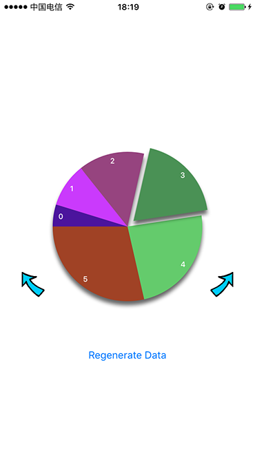

## CYPieChart

CYPieChart is a subclass of UIView that displays your data in a pie chart.

### Preview

By default ,all the description labels are place within the pie chart.

By these labels can also be placed outside.

### Intergration

#### Cocoapods
Simply add 

`
	use_frameworks!
`

and

` pod 'CYPieChart'
`

to your Podfile ,and Cocoapods does the magic !

#### Do it your self

Clone or download the project , drag the entire CYPieChart Folder into your project , and then :

` 
	#import "CYPieChart.h"
`

,and you are ready to go.

### Usage

To use CYPieChart ,your code would be something like this:
<pre>
<code>
	for (NSUInteger i = 0; i < count; ++i) 
	{
        PieChartDataObject *obj = [[PieChartDataObject alloc] initWithTitle:@"String Representation Of Your Data" value: value of your data]; 
        [objectArray addObject:obj];
    }
    for (NSUInteger i = 0; i < count; ++i) {
        [colorArray addObject:UIColor Object];
    }
	self.pieChart.objects = objectArray;
	self.pieChart.colors = colorArray;
	[self.pieChart updateAppearance];
</code>
</pre>

You specify what data the chart is going to present along with the colors that it uses presenting those data , you can also set other properties such as `moveRadius` ,` titlePosition` to customize the appearance of the chart. At last , you MUST call `[pieChart updateAppearance]` to notify the pie chart to update its appearance.

#### Update 0.0.2
Add new feature ,labels can no be placed outside , set `pieChart.titleLayout = TitleLayout_Bottom` or `pieChart.titleLayout = TitleLayout_Right` will do the trick.

Notice that if you place the labels outside the pie chart , the value of `titlePosition` will not be used.

For more detail ,plz clone or download the zip and view the sample project.

If there is any problems / suggestions ,I'll be very grateful to hear from you!